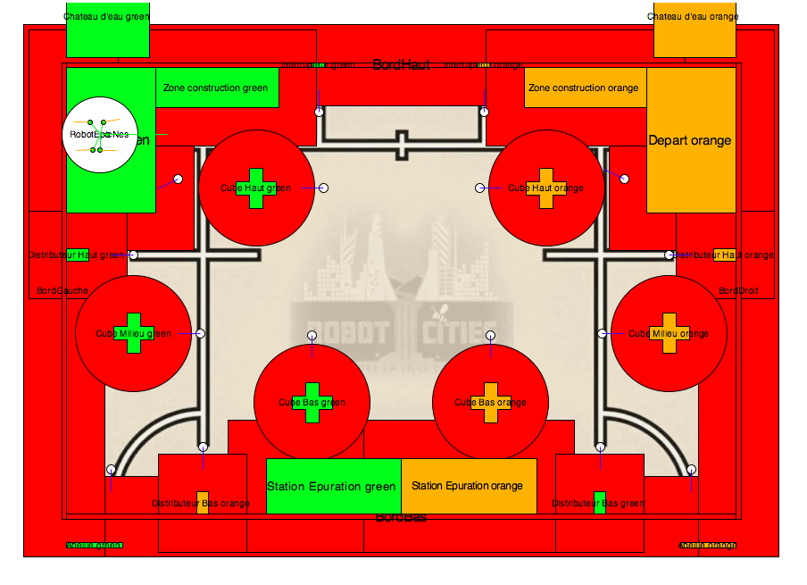

# IA_robot
Intelligence artificielle pour robot destiné à participer à la Coupe De France de Robotique

**This project is now being replaced by its version 2 implemented in nodejs: https://github.com/nesnes/Eurobot-AI**

# Installation
 - Install python 2.7 on your windows/mac/linux
 - Install the `numpy` and `pyserial` python packages
    - `python -m pip install numpy pyserial`
 - On Raspberry, disable serial Boot console:
    - `sudo raspi-config [enter] [5]InterfaceOptions->[P6]->disable bootSerial, enable hardware`
    - reboot
 - Run the IA with `python main.py`

# Usage
This IA is designed to be easily customizable with new xml files describing the **maps**, **goals**, and **robots**.

> The **map** is the top down 2D view of the environment. It contains the position of the object and obstacles with some metadat like: color of the object, type of object, position to be reached to access it, shape and so on.

> The **goals** are the list of action to be done on the map. They are executed by the IA if the conditions are matched.

> The **robot** is a set of value describing its size, its starting positions on the table, it storage capacity, its connected boards and so on.

All the aspect are described from the following architecture:

- IA
    - map `map2017.xml`
        - size `3000x2000`
        - points of interest `list`
            - name `BlueStartingArea`
            - type `starting_area`
            - color `blue`
            - shape `rectangle x y w h`
            - avoidance area `rectangle x-10 y-10 w+10 h+10`
            - access position `x y angle`
    - goals `goalsStategy1FirstRobot2017.xml`
        - goals `list`
            - name
            - points
            - time to execute
            - actions `list`
                - pythonMethod  `moveToElement`
                    - argument1 `name=BlueStartingArea`
                    - argument2 `speed=0.5`
                - onError
                    - actions `closeLeftStorageDoor`
            - conditions `list`
                - or/and
                    - variable
                        - name `leftStorage`
                        - condition `notZero`
    - robot `FirstRobot2017.xml`
        - name `FirstRobot`
        - class `FirstRobot`
        - radius `175mm`
        - startingPositions
            - name `Blue side start position`
            - color `blue`
            - x, y, angle
        - boards
            - name `movingBase V1`
            - function `movingBase`
            - communication `serial`
        - equipments
            - name `LeftStorageUnit`
            - type `variable`
            - value `0`
            - max `5`
            ---
            - name `Front IR sensor`
            - type `telemeter`
            - id `0`
            - x, y, angle `In the robot`

# Customize
All the used (xml) files are selected in web interface. You can edit files and start simulations or live match from the web interface. (No internet connection required)

## Creating a new map
All the previous map.xml files are contained in the corresponding folder. Just duplicate and rename the latest one, and edit the point of interest.

## Creating a new Robot
To create a new robot, just duplicate a modify an existing robot file, and implement a class which inherits from the actual Robot.py class. It will contain all the custom functions of your robot like *openLeftStorage*, *moveRoboticArm*, *startCollectedObjectSorting* and so on. The default Robot.py class handles the more shared functions like *moveToXY* or *waitForStartSignal*. The name of the robot your xml file will be used to find a corresponding python class. The default robot class will be loaded if not found.

> `name=myRobot` in `robots/myRobot.xml` will load `robots.myRobot.MyRobot` from `robots/myRobot.py` if it has been added in `robots/__init__.py`

## Creating new goals
To create a new goal file, just duplicate a modify an existing one. Since it will be used with your own robot class, you can use your own robot functions and the ones from the root Robot class. You can also use conditions on the variables (storageLocations) on your robot.

# Interfacing with your hardware robot
Your robot.xml file list the boards connected to it. It can use the default existing ones like *controlPanel*, *movingBase*, or *collisionDetector*. The IA will look for these boards to execute the movements and receive signals. The communication protocol is described in each files and in the root `board.py`.

> To be loaded, your board must be added in `boards/__init__.py`

# Feedback
Please write an issue if any bug is found or if you want to discuss about an implmentation. Notice that the project is still under development (May 2018).
